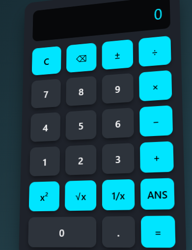

# 3D Calculator ― XOBE DEVELOPMENT

🔢 **Kalkulator 3‑D interaktif** berbasis HTML, CSS, dan JavaScript (tanpa dependensi eksternal).  
Dirancang untuk tampil _miring_ secara perspektif 3‑D lalu melurus saat disentuh, lengkap dengan efek hover dan animasi _soft‑shadow_.  

## Fitur
| Kategori | Detail |
|----------|--------|
| Tampilan | Desain 3‑D, responsif, dark‑gradien, animasi hover |
| Input    | Klik tombol / keyboard (0‑9, + − × ÷ % . Enter, Backspace, C) |
| Fungsi   | `+ − × ÷ %`, **x²**, **√x**, **1/x**, **±** toggle, **ANS** (jawaban terakhir) |
| Aksesibilitas | `aria-label="3D Calculator"` & ukuran tombol >44 px |

## Cara Pakai
1. Simpan `index.html` (file tunggal berisi HTML + CSS + JS).  
2. Buka di browser modern (Chrome, Edge, Firefox, Safari).  
3. Pasang ke situs statis (GitHub Pages, Netlify, Vercel, dsb) bila ingin daring.

## Struktur Kode
index.html
┣━ <style> ──── ▸ semua CSS di‐inline
┗━ <script> ──── ▸ logika kalkulator + keyboard handler

## Kontribusi
Pull request dipersilakan 🎉 – perbaikan bug, refactor ES6+, atau penambahan fungsi ilmiah (sin, cos, log, dsb).

## Kredit
Made with ❤️ by **XOBE DEVELOPMENT** – 2025.  
Terima kasih kepada komunitas open‑source.

## Lisensi
Proyek ini dilisensikan di bawah MIT License – lihat [`LICENSE.md`](./LICENSE.md) untuk detail.
